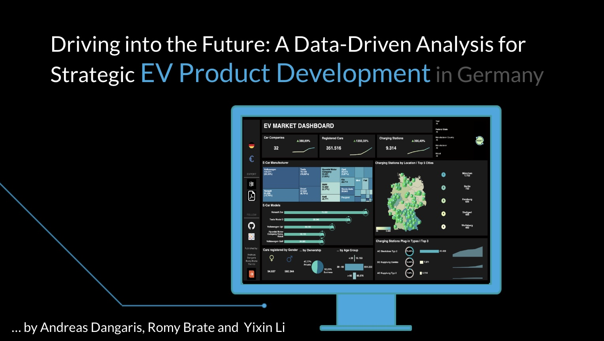

## Introduction

This project is a Capstone Project completed during participation in a Data Analytics Bootcamp by neuefische GmbH.

We have created an imaginary business case where SONY, a multinational company headquartered in Tokyo, Japan, has announced its plans to enter the EV market in 2025. SONY has hired us as Data Analyst Consultants to work with their R&D Department. Our task is to research the development of the German EV market, identify key car-related figures to consider before launching a new EV in Germany, and develop a KPI Dashboard.

The research was conducted as follows:

We provided a brief, simple, and concise overview of the car market.

Next, we investigated three main areas: Competitors, EV Infrastructure, and Target Group.

Competitors: We examined the overall competition as well as SONY's domestic competition in Japan.
EV Infrastructure: Our focus was on the newly gained charging stations.
Target Group: We analyzed the target group based on gender and usage types.

Recommendations & Future Analysis:

Based on our investigation, we provided three recommendations to our stakeholders. Additionally, we suggested conducting a deep-dive analysis of specific competitors and a car-feature analysis to further inform decision-making.

KPI1: Car Companies
KPI2: Registered Cars
KPI3: Charging Stations

Additional Dashboard Features (divided into two main themes):
DB-Feature1: E-Car Manufacturer
DB-Feature2: E-Car Models
DB-Feature3: Target Group Section with numbers on - Gender / Ownership / Age Group
DB-Feature4: Map of Germany - Location of charging stations / Ranked Cities
DB-Feature5: Connector types of charging stations

## Data Source

The data used in this project comes from the following sources:

- [Bundesnetzagentur - Ladesäulenregister](https://www.bundesnetzagentur.de/DE/Fachthemen/ElektrizitaetundGas/E-Mobilitaet/Ladesaeulenkarte/start.html)
- [Kraftfahrt-Bundesamt - Neuzulassungen von Personenkraftwagen (Umwelt)](https://www.kba.de/DE/Statistik/Fahrzeuge/Neuzulassungen/Umwelt/n_umwelt_node.html)
- [Kraftfahrt-Bundesamt - Fahrzeugzulassungen von Personenkraftwagen (Marke, Hersteller)](https://www.kba.de/DE/Statistik/Produktkatalog/produkte/Fahrzeuge/fz6_b_uebersicht.html)

## Pitch Deck Source

- [Branding Style Guide](https://brandingstyleguides.com/guide/sony-make-believe/): SONY MAKE.BELIEVE. Design Guidelines (Template)
- [Flaticon](https://www.flaticon.com/): Icons

## Data Cleaning

We performed ETL (Extract, Transform, Load) to prepare the data for analysis using various tools and programming languages.

- We extracted the data from public data sources and imported them into Excel/Sheets and Jupyter Notebook using Python.
- We transformed the data by filtering, dropping irrelevant columns, replacing missing values with appropriate values using the forward fill method, and converting the data types of some columns.
- We performed simple and advanced Exploratory Data Analysis (EDA) using Python libraries such as Pandas, Matplotlib, and Seaborn.
- The cleaned data was loaded into our PostgreSQL server using DBeaver.
- Further cleaning and creating of Primary/Foreign keys were performed in SQL.
- We connected the cleaned DataFrames from PostgreSQL to Tableau for visualization.

Tools used:
- Python (in Jupyter Notebook)
- VSC
- PostgreSQL (in DBeaver)
- Google Sheets/ Microsoft Excel
- Tableau
